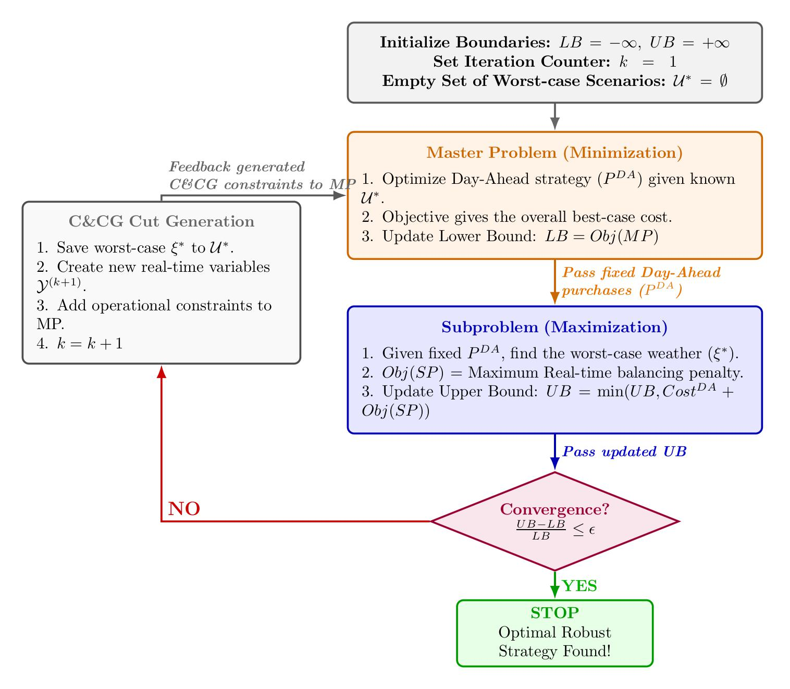
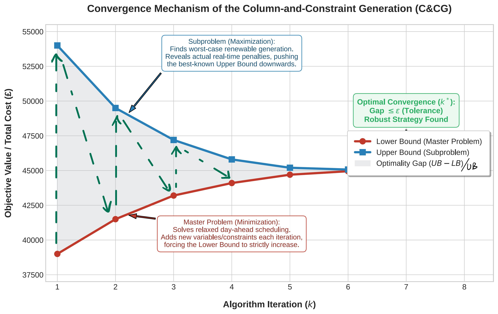

# Robust-Optimization-for-Battery-Energy-Storage-Scheduling-in-Microgrids
Data-driven two-stage robust optimization model for microgrid battery scheduling using Julia (JuMP) and Gurobi, solved via the Big-M method and C&amp;CG algorithm.

## Data-Driven Scenario Generation
To accurately capture the real-world volatility of renewable energy, this project relies on empirical meteorological data rather than subjective assumptions.
* **Data Source:** Hourly photovoltaic (PV) and wind power generation data for Birmingham (2025) was sourced from [Renewables.ninja](https://www.renewables.ninja/).
* **K-Means Clustering:** Instead of relying on simple annual averages, the raw time-series data was partitioned into **four distinct meteorological clusters** using the K-means algorithm.
* **Uncertainty Sets:** For each cluster, the mathematical centroid serves as the nominal forecast baseline ($\bar{P}_t$), and the 95% confidence interval defines the maximum deviation bound ($\Delta P_t$) for the robust optimization model.

```math
  \begin{align}
    & P_{t}^{re} = \bar{P}_{t}^{re} - \xi_{t} \cdot \Delta{P}_{t}^{re}, && \forall t \in [1,T] \\
    & \mathcal{U} = \left\{ \xi \in \mathbb{R}^T \ \Big| \ -1 \leq \xi_t \leq 1, \quad \sum_{t=1}^T |\xi_t| \leq \Gamma \right\}, && 0 \leq \Gamma \leq 24
  \end{align}
```

## Two-stage Objective Function and Constraints
```math
\begin{equation}
    \min_{\mathcal{X}} \sum_{t=1}^{T}\left(\lambda_{t}^{DA} \cdot P_{t}^{DA}\right) +
    \max_{\xi \in \mathcal{U}}\min_{\mathcal{Y}} \sum_{t=1}^{T} \left(\lambda_{t}^{RT\_buy} \cdot P_{t}^{RT\_buy} - \lambda_{t}^{RT\_sell} \cdot P_{t}^{RT\_sell}\right)
\end{equation}
```

```math
\begin{align}
    \text{s.t.} \quad
    & P_{t}^{re} + P_{t}^{DA} + P_{t}^{dis} + P_{t}^{RT\_buy} = P_{t}^{load} + P_{t}^{char} + P_{t}^{RT\_sell}, && \forall t \in [1,T]\\
    & Soc_{t} = Soc_{t-1} + \eta_{char} \cdot P_{t}^{char} - \frac{P_{t}^{dis}}{\eta_{dis}}, && \forall t \in [1,T]\\
    & Soc_{min} \leq Soc_{t} \leq Soc_{max}, && \forall t \in [1,T]\\
    & P_{t}^{char} \leq P_{max}^{char} \cdot u_{t}^{char}, && \forall t \in [1,T]\\
    & P_{t}^{dis} \leq P_{max}^{dis} \cdot u_{t}^{dis}, && \forall t \in [1,T]\\
    & u_{t}^{dis} + u_{t}^{char} \leq 1, && \forall t \in [1,T]\\
    & u_{t}^{dis}, u_{t}^{char} \in \left\{0, 1\right\}, && \forall t \in [1,T]\\
    & P_{t}^{DA}, P_{t}^{dis}, P_{t}^{char} \geq 0. && \forall t \in [1,T]
\end{align}
```

## Column and Constraints Generation





## Monte Carlo Simulation Experiments
